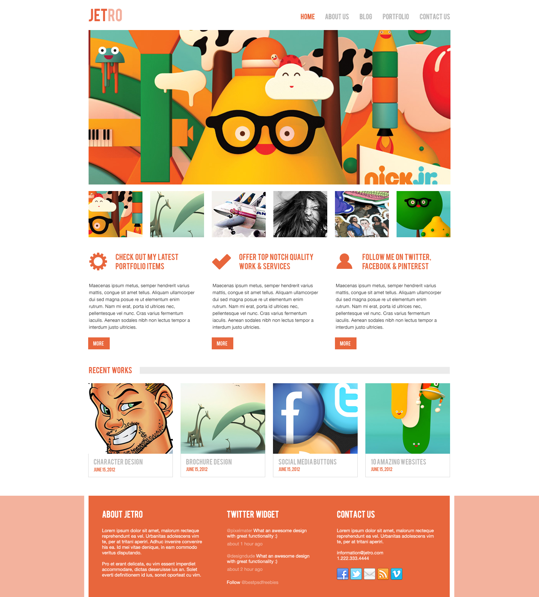

## Project overview

1. container - own grid system (file - 'mixin.scss')
2. assembly - Gulp
3. SASS 
4. BEM
4. slider - Slick slider

* all interactive elements have :hover, :focus 
* validity HTML/CSS
* Semantics of layout
* Adaptive - mobile, table

